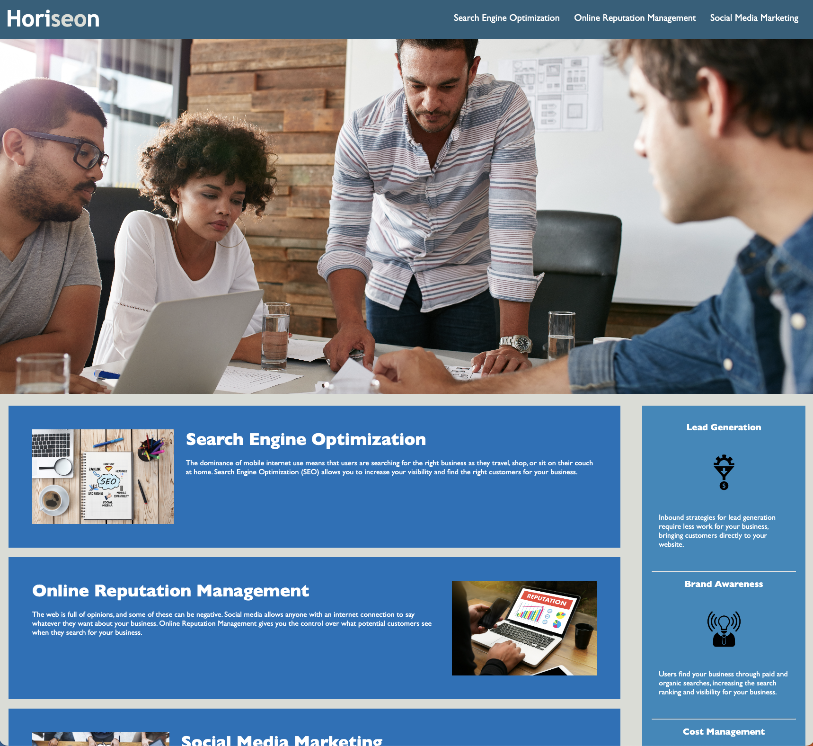

# Website Optimization for Horiseon

## Refined code by:

* Adding more semantic tags to create specifity for the browser, allowing for a smoother website
* Adjusting the style sheet to keep the original aesthetic intact
* Repaired a broken link in the header

### The website should now run more smoothly for client function, thus making it more accessable for use.

### Go to the website [here.](https://lrltillman.github.io/semantic-html/)

### A screenshot of a portion of the website is below:

